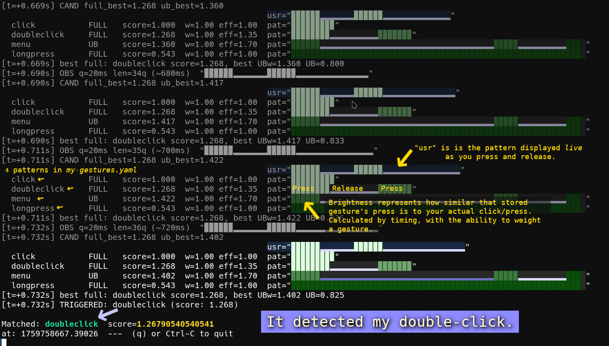

# Single-Button Gesture Recognition System

*by jaggz.h {who is at} gmail.com*

A timing-based gesture recognizer for **one physical button** (e.g., an accessibility switch). It lets users trigger rich actions (click, double-click, menu, long-press, custom sequences) by **press/release timing patterns** rather than multiple buttons.

This document explains **why it exists**, **how it works** (conceptually and mathematically), and **where** to change things in code. It’s optimized so another LLM or engineer can jump in cold and still make safe edits.

# DIY Captions:
<div align="center">
  <em>Testing gestures (patterns) from my-gestures.yaml...</em><br>
  <br>
</div>

---

## To just try it out
1. Clone the project
1. and run `./test-gestures-mouse`
1. Try *click*, *doubleclick*, *longpress*, and other(s) listed when you run it

**Those are loaded from my-gestures.yaml**

## You can hand-craft your gestures

1. But it's easier to run the "gesture" collection program here, `./hid-learn`
1. When you run it, it'll be collecting one pattern (like "click .. click").
1. Repeat your pattern as many times as you want.
1. Hit **CTRL-C** to finish

It'll output the averaged out lines you can put right into `my-gestures.yaml` or your own file.

If you use `my-gestures.yaml` as your filename it'll load automatically into `./test-gestures-mouse`
for you to try it out.

**Note:** For better visibility, `./test-gestures-mouse` shows the *clicks* and *pauses* with
blocky characters.

---

## Why this exists

- **Accessibility first.** Some users only have a single reliable input. Timing-based gestures turn one button into a language of actions.
- **Robust to human variability.** People don’t click with metronomic precision. We match elastically with tolerance and scaling, not exact counts.
- **Low-quanta representation.** We use only two symbols today:
  - `.` = press (button down duration)
  - `~` = pause (button up duration)
  (Historically `-`/`+` were used; they’re **normalized** away now for simplicity but can return later.)

---

## System overview

**Input** → **Runs** → **Scoring** → **Decision** → **Callback**

1. **Edge events** (`press`/`release`) are collected: `feed_event(kind, t)`  
   *Code:* `Recognizer.pm::feed_event`, `tick`, `_obs_runs_with_virtual`

2. **Observation runs** are computed in **quanta** of `quantum_ms`:  
   A run is `{ sym: '.'|'~', len: quanta }`. We *append a virtual trailing run to “now”* so patterns can be evaluated continuously.  
   *Code:* `Recognizer.pm::_obs_runs_with_virtual`

3. **Patterns** are loaded/compiled from YAML.  
   - Pattern string is a sequence of `.` and `~`.  
   - Suffix markers:
     - `)` = **terminal**: do not penalize the *final observed* run while it’s still growing (indeterminate tail).
     - `>` = **continues**: advisory hint (not currently used in decisions).
   - Normalization: remove `+`, map `-`→`.`.  
   - Per-symbol **elasticity** tolerances and per-pattern **weight** are supported.  
   *Code:* `Recognizer.pm::_load_and_compile`, `_canonicalize_pattern`, `_runs_from_pattern`

4. **Scoring** compares the observation prefix against each candidate pattern with:
   - **Global stretch** `s ∈ [stretch_min, stretch_max]` chosen from the *prefix* duration ratio.
   - **Per-run penalty with tolerance** (elasticity) and **run weights**.
   - **Effective pattern weight** (base weight × press-bias prior).  
   *Code:* `Recognizer.pm::_full_score`, `_prefix_upperbound`, `_score_from_err_den`

5. **Decision** balances immediacy vs waiting for a possible super-sequence:
   - Commit immediately if best FULL score beats any **supersequence UB** by `commit_margin`.
   - Otherwise wait, but at most `decision_timeout_s` (capped by remaining time needed for any supersequence) and adjusted by `wait_preference`.
   - Prefer longer FULL matches when close via `prefer_longer_margin`.
   - Guard: don’t commit press-ending patterns while still physically pressed (`require_release_for_dot_end`).  
   - Timeout guard: optionally **ignore UB** on timeout (`ignore_ub_on_timeout`) to prevent long stalls.  
   *Code:* `Recognizer.pm::_evaluate_if_ready`, `_max_remaining_time_for_any_supersequence`, `_commit`

6. **Visualization & debug** make it tangible:
   - One-line abbreviated user/pattern lines with **per-run color** by penalty.
   - Optional full-line renders.  
   *Code:* `Recognizer.pm::_debug_dump_observation`, `_debug_dump_candidates`, `_viz_*` helpers  
   *Comments to grep:* `VIS:` and `DEBUG:` tags near relevant blocks.

---

## Data model

### Observation runs
- Built from edge events at `quantum_ms` resolution.
- Always includes a **virtual trailing run** from the last edge to “now” (so we can score while a run is growing).
- Example: press 80 ms, pause 120 ms, press 60 ms @ 20 ms quantum → runs roughly `. . . .  ~ ~ ~ ~ ~ ~  . . .`

### Pattern grammar (YAML)
```yaml
gestures:
  - name: click
    pattern: ".~)"     # terminal: don’t penalize trailing '~' while it’s still growing
    weight: 0.9
    elasticity: { ".": 1, "~": 2 }   # tolerances in quanta

  - name: doubleclick
    pattern: ".~.~)"
    weight: 1.2
    elasticity: { ".": 1, "~": 5 }

  - name: longpress
    pattern: "....................................)"  # many '.'; terminal
    weight: 1.0
    elasticity: { ".": 6 }
